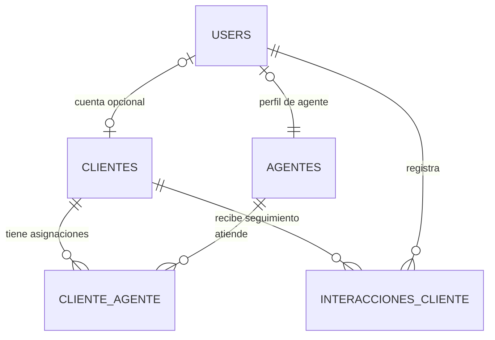
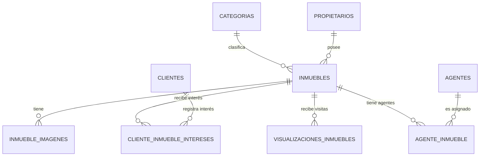
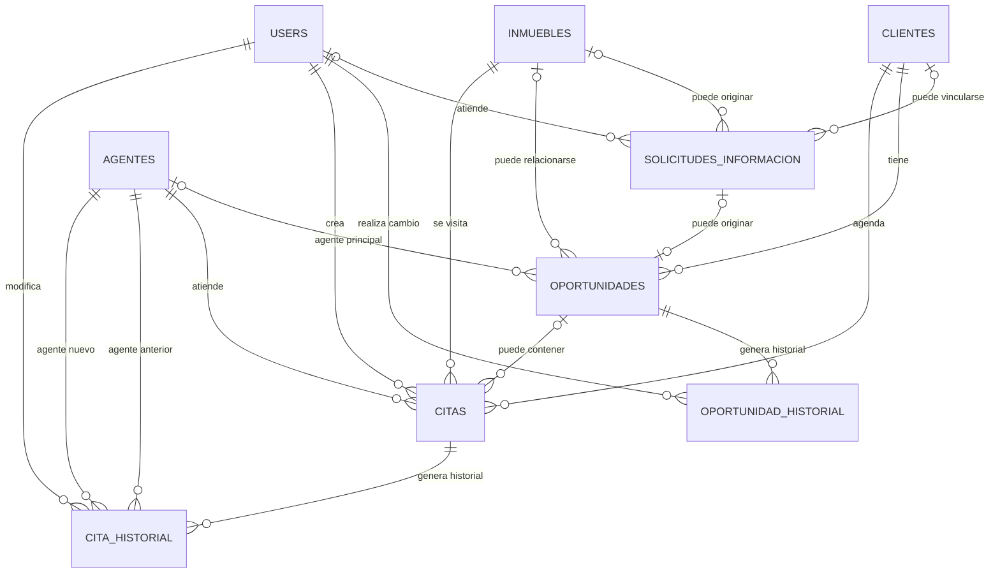
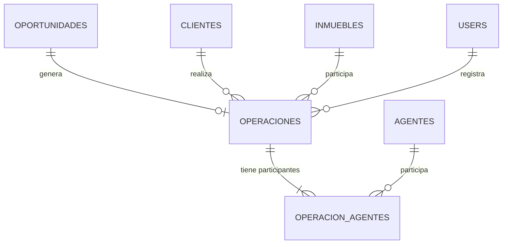
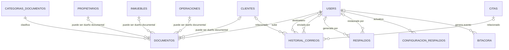

# ERD — Sistema Web para Gestión Inmobiliaria

**Proyecto:** Sistema Web para Gestión Inmobiliaria  
**Empresa:** SotyTech  
**Base de datos:** `sotytech_bd_v3`  
**Motor:** MariaDB 11.4 / InnoDB  
**Codificación:** `utf8mb4`  
**Estado del modelo:** Aprobado para traducción a migraciones Laravel  
**Fecha de revisión:** 24/09/2026

---

## 1. Objetivo

Este documento describe el modelo entidad–relación aprobado para el sistema inmobiliario. Resume:

- las 25 tablas funcionales propias del sistema;
- la clasificación de cada entidad;
- las relaciones y cardinalidades;
- las claves foráneas principales;
- las reglas de integridad que quedan en MariaDB;
- las reglas de negocio que deberán validarse en Laravel.

El esquema físico de referencia se conserva en:

```text
docs/database/sotytech_bd_v3_schema.sql
```

---

## 2. Convenciones

### Cardinalidades

| Notación | Significado |
|---|---|
| `0..1` | Cero o uno |
| `1..1` | Exactamente uno |
| `0..N` | Cero, uno o muchos |
| `1..N` | Uno o muchos |

### Clasificación de entidades

- **Entidad fuerte:** tiene identidad propia y puede identificarse mediante su propia PK.
- **Entidad dependiente:** tiene PK propia, pero su existencia funcional depende de otra entidad.
- **Entidad asociativa:** resuelve una relación M:M y puede almacenar atributos de esa relación.
- **Entidad transaccional:** representa un evento o proceso del negocio.
- **Entidad histórica / auditoría:** conserva eventos pasados y normalmente no debe eliminarse ni modificarse.
- **Entidad de configuración:** almacena parámetros operativos del sistema.

### Convenciones físicas

- PK principal: `id BIGINT UNSIGNED AUTO_INCREMENT`.
- Motor: `InnoDB`.
- Charset: `utf8mb4`.
- Collation: `utf8mb4_unicode_ci`.
- Baja lógica mediante `deleted_at` cuando aplica.
- Estados de negocio mediante `VARCHAR` + `CHECK`.
- Los roles y permisos no se almacenan en `users`; serán gestionados por Spatie Laravel Permission.

---

# 3. Resumen de entidades

| # | Tabla | Tipo |
|---:|---|---|
| 1 | `users` | Fuerte |
| 2 | `clientes` | Fuerte |
| 3 | `agentes` | Dependiente |
| 4 | `propietarios` | Fuerte |
| 5 | `categorias` | Fuerte |
| 6 | `inmuebles` | Fuerte |
| 7 | `inmueble_imagenes` | Dependiente |
| 8 | `cliente_inmueble_intereses` | Asociativa |
| 9 | `agente_inmueble` | Asociativa |
| 10 | `cliente_agente` | Asociativa |
| 11 | `interacciones_cliente` | Dependiente / transaccional |
| 12 | `solicitudes_informacion` | Transaccional |
| 13 | `oportunidades` | Transaccional |
| 14 | `oportunidad_historial` | Dependiente / histórica |
| 15 | `citas` | Transaccional |
| 16 | `cita_historial` | Dependiente / histórica |
| 17 | `operaciones` | Transaccional |
| 18 | `operacion_agentes` | Asociativa |
| 19 | `categorias_documentos` | Fuerte |
| 20 | `documentos` | Dependiente / transaccional |
| 21 | `visualizaciones_inmuebles` | Dependiente / transaccional |
| 22 | `historial_correos` | Histórica / transaccional |
| 23 | `respaldos` | Histórica / transaccional |
| 24 | `configuracion_respaldos` | Configuración |
| 25 | `bitacora` | Histórica / auditoría |

---

# 4. Diagrama general por dominios

## 4.1 Usuarios, clientes y agentes



### Lectura

- Un `user` puede estar asociado con `0..1` `cliente`.
- Un `cliente` puede tener `0..1` `user`.
- Un `user` puede representar `0..1` agente.
- Todo `agente` debe tener exactamente `1..1` `user`.
- `cliente_agente` resuelve la relación M:M entre clientes y agentes.

---

## 4.2 Propiedades



### Lectura

- Cada inmueble pertenece a exactamente un propietario.
- Cada inmueble pertenece a exactamente una categoría.
- Un inmueble puede tener varias imágenes.
- Cliente e inmueble se relacionan M:M mediante `cliente_inmueble_intereses`.
- Agente e inmueble se relacionan M:M mediante `agente_inmueble`.

---

## 4.3 Solicitudes, oportunidades y citas



---

## 4.4 Cierre comercial



---

## 4.5 Documentos, correos, respaldos y auditoría



---

# 5. Detalle por tabla

## 5.1 `users`

**Tipo:** Entidad fuerte.

**Propósito:** Cuenta autenticada del sistema.

**PK**

```text
id
```

**Campos clave**

- `email` — único.
- `password`.
- `estado`.
- `email_verified_at`.
- `last_login_at`.
- `remember_token`.
- `deleted_at`.

**Estados permitidos**

```text
pendiente
activo
bloqueado
inactivo
```

**Relaciones destacadas**

- `0..1 ↔ 0..1` con `clientes`.
- `0..1 ↔ 1..1` con `agentes`.
- Referenciada por citas, historiales, documentos, respaldos, bitácora y otros procesos.

**Nota**

La tabla no contiene columna `rol`. Los roles y permisos serán gestionados posteriormente por Spatie Laravel Permission.

---

## 5.2 `clientes`

**Tipo:** Entidad fuerte.

**Propósito:** Prospectos y clientes del negocio.

**FK**

```text
user_id -> users.id
```

`user_id` es nullable y unique.

Esto permite:

- prospecto sin cuenta;
- cliente con cuenta;
- máximo una cuenta vinculada por cliente.

**Estados**

```text
prospecto
cliente
inactivo
```

**Tipo de interés**

```text
compra
renta
ambos
```

**Regla de presupuesto**

```text
presupuesto_max >= presupuesto_min
```

cuando ambos valores existen.

---

## 5.3 `agentes`

**Tipo:** Entidad dependiente.

**Propósito:** Perfil inmobiliario de un usuario con función de agente.

**FK obligatoria**

```text
user_id -> users.id
```

`user_id` es `NOT NULL` y `UNIQUE`.

**Relación**

```text
USERS (0..1) ---- (1..1) AGENTES
```

**Campos importantes**

- `numero_empleado` único.
- `telefono_corporativo`.
- `zona_asignacion`.
- `horario`.
- `porcentaje_comision`.
- `foto_path`.
- `estado_laboral`.

**Comisión**

```text
0 <= porcentaje_comision <= 100
```

---

## 5.4 `propietarios`

**Tipo:** Entidad fuerte.

**Propósito:** Propietarios de inmuebles. No tienen login.

**Tipos**

```text
fisica
moral
```

**Campos clave**

- `nombre_razon_social`.
- `rfc` único.
- `telefono`.
- `email`.
- `direccion`.

**Relación**

```text
PROPIETARIOS (1..1) ---- (0..N) INMUEBLES
```

---

## 5.5 `categorias`

**Tipo:** Entidad fuerte.

**Propósito:** Clasificación de inmuebles.

Ejemplos:

```text
Casa
Departamento
Terreno
Local comercial
```

**Relación**

```text
CATEGORIAS (1..1) ---- (0..N) INMUEBLES
```

---

## 5.6 `inmuebles`

**Tipo:** Entidad fuerte.

**Propósito:** Registro principal de propiedades.

**FK obligatorias**

```text
propietario_id -> propietarios.id
categoria_id   -> categorias.id
```

**Identificadores únicos**

```text
codigo
slug
```

**Operaciones permitidas**

```text
venta
renta
```

**Estados**

```text
disponible
vendido
rentado
inactivo
```

**Ubicación**

Se almacena:

- dirección textual;
- `latitud`;
- `longitud`.

Las coordenadas serán usadas por Leaflet + OpenStreetMap.

**Regla de precio**

Si:

```text
tipo_operacion = venta
```

debe existir `precio_venta` y `renta_mensual` debe ser NULL.

Si:

```text
tipo_operacion = renta
```

debe existir `renta_mensual` y `precio_venta` debe ser NULL.

---

## 5.7 `inmueble_imagenes`

**Tipo:** Entidad dependiente.

**FK**

```text
inmueble_id -> inmuebles.id
```

**Relación**

```text
INMUEBLES (1..1) ---- (0..N) INMUEBLE_IMAGENES
```

**Propósito**

Guardar referencias a imágenes almacenadas en Firebase Storage.

**Campos importantes**

- `firebase_path`.
- `url_publica`.
- `es_principal`.
- `orden`.
- `texto_alternativo`.

**Regla en Laravel**

Debe existir como máximo una imagen principal por inmueble.

---

## 5.8 `cliente_inmueble_intereses`

**Tipo:** Entidad asociativa.

**Resuelve**

```text
CLIENTES M:M INMUEBLES
```

**FK**

```text
cliente_id  -> clientes.id
inmueble_id -> inmuebles.id
```

**Restricción única**

```text
(cliente_id, inmueble_id)
```

**Nivel de interés**

```text
bajo
medio
alto
```

**Estados**

```text
activo
descartado
convertido
```

**Regla**

Al existir soft delete y restricción única, un interés descartado no debe recrearse como una nueva fila duplicada; debe actualizarse o restaurarse el registro existente.

---

## 5.9 `agente_inmueble`

**Tipo:** Entidad asociativa.

**Resuelve**

```text
AGENTES M:M INMUEBLES
```

**FK**

```text
agente_id   -> agentes.id
inmueble_id -> inmuebles.id
```

**Atributos de relación**

- `es_principal`.
- `fecha_asignacion`.

**Restricción única**

```text
(agente_id, inmueble_id)
```

**Reglas en Laravel**

- Un inmueble debe tener al menos un agente asignado.
- Debe existir un solo agente principal por inmueble.

---

## 5.10 `cliente_agente`

**Tipo:** Entidad asociativa.

**Resuelve**

```text
CLIENTES M:M AGENTES
```

**FK**

```text
cliente_id -> clientes.id
agente_id  -> agentes.id
```

**Atributos**

- `es_principal`.
- `fecha_asignacion`.

**Regla en Laravel**

Un cliente puede tener varios agentes, pero como máximo uno debe ser principal.

---

## 5.11 `interacciones_cliente`

**Tipo:** Entidad dependiente / transaccional.

**Propósito:** Historial de contacto y seguimiento comercial.

**FK**

```text
cliente_id              -> clientes.id
registrado_por_user_id  -> users.id
```

**Tipos**

```text
llamada
correo
whatsapp
reunion
nota
seguimiento
```

**Relaciones**

```text
CLIENTES (1..1) ---- (0..N) INTERACCIONES_CLIENTE
USERS    (1..1) ---- (0..N) INTERACCIONES_CLIENTE
```

---

## 5.12 `solicitudes_informacion`

**Tipo:** Entidad transaccional.

**Propósito:** Registrar formularios enviados desde la landing pública.

**FK opcionales**

```text
inmueble_id          -> inmuebles.id
cliente_id           -> clientes.id
atendida_por_user_id -> users.id
```

**Cardinalidades**

```text
INMUEBLES (0..1) ---- (0..N) SOLICITUDES_INFORMACION
CLIENTES  (0..1) ---- (0..N) SOLICITUDES_INFORMACION
USERS     (0..1) ---- (0..N) SOLICITUDES_INFORMACION
```

**Estados**

```text
nueva
en_atencion
atendida
descartada
```

**Medio preferido**

```text
telefono
whatsapp
correo
```

---

## 5.13 `oportunidades`

**Tipo:** Entidad transaccional.

**Propósito:** Tarjetas del Kanban comercial.

**FK**

```text
cliente_id                -> clientes.id
inmueble_id               -> inmuebles.id
agente_principal_id       -> agentes.id
solicitud_informacion_id  -> solicitudes_informacion.id
```

Solo `cliente_id` es obligatorio.

**Etapas**

```text
contacto_inicial
cita
negociacion
documentacion
cierre
```

**Estados**

```text
activa
ganada
perdida
cancelada
```

**Restricción**

```text
solicitud_informacion_id UNIQUE
```

Por tanto, una solicitud puede originar como máximo una oportunidad.

---

## 5.14 `oportunidad_historial`

**Tipo:** Entidad dependiente / histórica.

**Propósito:** Conservar movimientos y cambios del Kanban.

**FK**

```text
oportunidad_id       -> oportunidades.id
cambiado_por_user_id -> users.id
```

**Eventos**

```text
creacion
cambio_etapa
cambio_estado
```

**Regla histórica**

- No usa `updated_at`.
- La FK a `oportunidades` utiliza comportamiento restrictivo.
- El historial no debe editarse ni eliminarse normalmente.

---

## 5.15 `citas`

**Tipo:** Entidad transaccional.

**FK obligatorias**

```text
cliente_id          -> clientes.id
agente_id           -> agentes.id
inmueble_id         -> inmuebles.id
creado_por_user_id  -> users.id
```

**FK opcional**

```text
oportunidad_id -> oportunidades.id
```

**Estados**

```text
programada
confirmada
completada
cancelada
no_asistio
```

**Regla de fechas**

```text
fecha_fin > fecha_inicio
```

**Reglas en Laravel**

Antes de crear o reprogramar una cita se debe comprobar que no exista traslape:

1. con otra cita del mismo agente;
2. con otra cita del mismo inmueble.

---

## 5.16 `cita_historial`

**Tipo:** Entidad dependiente / histórica.

**Propósito:** Registrar reprogramaciones y cambios de agente.

**FK**

```text
cita_id                  -> citas.id
modificado_por_user_id   -> users.id
agente_anterior_id       -> agentes.id
agente_nuevo_id          -> agentes.id
```

**Tipos**

```text
reprogramacion
cambio_agente
reprogramacion_y_agente
```

**Información conservada**

- agente anterior;
- agente nuevo;
- horario anterior;
- horario nuevo;
- motivo;
- usuario que modificó;
- fecha de modificación.

---

## 5.17 `operaciones`

**Tipo:** Entidad transaccional.

**Propósito:** Registrar ventas o rentas cerradas.

**FK**

```text
oportunidad_id          -> oportunidades.id
cliente_id              -> clientes.id
inmueble_id             -> inmuebles.id
registrado_por_user_id  -> users.id
```

Todas son obligatorias.

**Restricción**

```text
oportunidad_id UNIQUE
```

Una oportunidad puede generar como máximo una operación.

**Tipos**

```text
venta
renta
```

**Estados**

```text
registrada
anulada
```

**Regla**

```text
monto > 0
```

**Regla en Laravel**

El tipo de operación debe ser coherente con el tipo configurado en el inmueble.

---

## 5.18 `operacion_agentes`

**Tipo:** Entidad asociativa.

**Resuelve**

```text
OPERACIONES M:M AGENTES
```

**FK**

```text
operacion_id -> operaciones.id
agente_id    -> agentes.id
```

**Atributos**

- `es_principal`.
- `porcentaje_comision`.
- `monto_comision`.

**Restricción única**

```text
(operacion_id, agente_id)
```

**Reglas en Laravel**

- Toda operación debe tener al menos un agente.
- Solo uno puede ser principal.
- La comisión registrada aquí representa el valor histórico aplicado a la operación.

---

## 5.19 `categorias_documentos`

**Tipo:** Entidad fuerte.

**Propósito:** Catálogo de documentos.

Ejemplos:

```text
INE
RFC
Escritura
Contrato
Comprobante de domicilio
Predial
```

**Relación**

```text
CATEGORIAS_DOCUMENTOS (1..1) ---- (0..N) DOCUMENTOS
```

---

## 5.20 `documentos`

**Tipo:** Entidad dependiente / transaccional.

**Propósito:** Referencias a archivos privados almacenados en Firebase Storage.

**FK obligatorias**

```text
categoria_documento_id -> categorias_documentos.id
subido_por_user_id     -> users.id
```

**FK opcionales de destino**

```text
propietario_id -> propietarios.id
cliente_id     -> clientes.id
inmueble_id    -> inmuebles.id
operacion_id   -> operaciones.id
```

**Regla principal**

Exactamente una de estas FK debe estar informada:

```text
propietario_id
cliente_id
inmueble_id
operacion_id
```

**Tipos de archivo permitidos**

```text
application/pdf
image/png
image/jpeg
```

---

## 5.21 `visualizaciones_inmuebles`

**Tipo:** Entidad dependiente / transaccional.

**Propósito:** Contabilizar visitas a fichas de propiedades para el reporte de inmuebles más consultados.

**FK**

```text
inmueble_id -> inmuebles.id
```

**Orígenes**

```text
landing_publica
portal_cliente
interno
```

**Privacidad**

Se almacena `ip_hash` en lugar de la IP directamente.

En Laravel el hash debe generarse usando un secreto/HMAC, no únicamente un SHA-256 directo de la IP.

---

## 5.22 `historial_correos`

**Tipo:** Entidad histórica / transaccional.

**Propósito:** Registrar intentos y resultados de envío de correos.

**FK opcionales**

```text
destinatario_user_id -> users.id
cliente_id           -> clientes.id
cita_id              -> citas.id
enviado_por_user_id  -> users.id
```

**Tipos**

```text
confirmacion_cita
reprogramacion_cita
cancelacion_cita
recuperacion_password
respaldo
restauracion
seguridad
otro
```

**Estados**

```text
pendiente
enviado
fallido
```

La tabla usa `created_at` y `updated_at` porque un intento puede cambiar de estado.

---

## 5.23 `respaldos`

**Tipo:** Entidad histórica / transaccional.

**Propósito:** Historial de respaldos y restauraciones.

**FK opcionales**

```text
generado_por_user_id   -> users.id
restaurado_por_user_id -> users.id
```

Pueden ser NULL para procesos automáticos.

**Tipos**

```text
manual
automatico
```

**Estados de respaldo**

```text
pendiente
en_proceso
completado
fallido
```

**Estados de restauración**

```text
en_proceso
completada
fallida
```

Usa `created_at` y `updated_at`.

---

## 5.24 `configuracion_respaldos`

**Tipo:** Entidad de configuración.

**Propósito:** Configurar la ejecución automática de respaldos.

**FK opcional**

```text
actualizado_por_user_id -> users.id
```

**Frecuencias**

```text
diario
semanal
mensual
```

**Regla de programación**

```text
diario:
    dia_semana = NULL
    dia_mes = NULL

semanal:
    dia_semana != NULL
    dia_mes = NULL

mensual:
    dia_semana = NULL
    dia_mes != NULL
```

**Rangos**

```text
dia_semana: 1..7
dia_mes:    1..28
retencion_dias >= 1
```

---

## 5.25 `bitacora`

**Tipo:** Entidad histórica / auditoría.

**Propósito:** Registrar acciones relevantes del sistema.

**FK opcional**

```text
user_id -> users.id
```

Es opcional porque también puede haber acciones automáticas.

**Referencia lógica**

```text
entidad
entidad_id
```

No son FK físicas. Permiten auditar diferentes tipos de registros sin crear una FK por cada tabla.

**Datos de auditoría**

```text
datos_anteriores JSON
datos_nuevos JSON
```

**Privacidad**

`ip_hash` debe generarse con HMAC o mecanismo equivalente usando un secreto del servidor.

---

# 6. Matriz de relaciones y cardinalidades

| Entidad A | Cardinalidad A | Entidad B | Cardinalidad B | Tipo |
|---|---:|---|---:|---|
| `users` | 0..1 | `clientes` | 0..1 | 1:1 opcional |
| `users` | 0..1 | `agentes` | 1..1 | 1:1 |
| `propietarios` | 1..1 | `inmuebles` | 0..N | 1:M |
| `categorias` | 1..1 | `inmuebles` | 0..N | 1:M |
| `inmuebles` | 1..1 | `inmueble_imagenes` | 0..N | 1:M |
| `clientes` | 1..1 | `cliente_inmueble_intereses` | 0..N | 1:M |
| `inmuebles` | 1..1 | `cliente_inmueble_intereses` | 0..N | 1:M |
| `agentes` | 1..1 | `agente_inmueble` | 0..N | 1:M |
| `inmuebles` | 1..1 | `agente_inmueble` | 1..N* | 1:M |
| `clientes` | 1..1 | `cliente_agente` | 0..N | 1:M |
| `agentes` | 1..1 | `cliente_agente` | 0..N | 1:M |
| `clientes` | 1..1 | `interacciones_cliente` | 0..N | 1:M |
| `users` | 1..1 | `interacciones_cliente` | 0..N | 1:M |
| `inmuebles` | 0..1 | `solicitudes_informacion` | 0..N | 1:M opcional |
| `clientes` | 0..1 | `solicitudes_informacion` | 0..N | 1:M opcional |
| `users` | 0..1 | `solicitudes_informacion` | 0..N | 1:M opcional |
| `clientes` | 1..1 | `oportunidades` | 0..N | 1:M |
| `inmuebles` | 0..1 | `oportunidades` | 0..N | 1:M opcional |
| `agentes` | 0..1 | `oportunidades` | 0..N | 1:M opcional |
| `solicitudes_informacion` | 0..1 | `oportunidades` | 0..1 | 1:1 opcional |
| `oportunidades` | 1..1 | `oportunidad_historial` | 0..N | 1:M |
| `users` | 1..1 | `oportunidad_historial` | 0..N | 1:M |
| `clientes` | 1..1 | `citas` | 0..N | 1:M |
| `agentes` | 1..1 | `citas` | 0..N | 1:M |
| `inmuebles` | 1..1 | `citas` | 0..N | 1:M |
| `users` | 1..1 | `citas` | 0..N | 1:M |
| `oportunidades` | 0..1 | `citas` | 0..N | 1:M opcional |
| `citas` | 1..1 | `cita_historial` | 0..N | 1:M |
| `users` | 1..1 | `cita_historial` | 0..N | 1:M |
| `agentes` | 1..1 | `cita_historial` | 0..N | 1:M, agente anterior |
| `agentes` | 1..1 | `cita_historial` | 0..N | 1:M, agente nuevo |
| `oportunidades` | 1..1 | `operaciones` | 0..1 | 1:1 |
| `clientes` | 1..1 | `operaciones` | 0..N | 1:M |
| `inmuebles` | 1..1 | `operaciones` | 0..N | 1:M |
| `users` | 1..1 | `operaciones` | 0..N | 1:M |
| `operaciones` | 1..1 | `operacion_agentes` | 1..N* | 1:M |
| `agentes` | 1..1 | `operacion_agentes` | 0..N | 1:M |
| `categorias_documentos` | 1..1 | `documentos` | 0..N | 1:M |
| `users` | 1..1 | `documentos` | 0..N | 1:M |
| `propietarios` | 0..1 | `documentos` | 0..N | 1:M opcional |
| `clientes` | 0..1 | `documentos` | 0..N | 1:M opcional |
| `inmuebles` | 0..1 | `documentos` | 0..N | 1:M opcional |
| `operaciones` | 0..1 | `documentos` | 0..N | 1:M opcional |
| `inmuebles` | 1..1 | `visualizaciones_inmuebles` | 0..N | 1:M |
| `users` | 0..1 | `historial_correos` | 0..N | 1:M opcional, destinatario |
| `users` | 0..1 | `historial_correos` | 0..N | 1:M opcional, enviado por |
| `clientes` | 0..1 | `historial_correos` | 0..N | 1:M opcional |
| `citas` | 0..1 | `historial_correos` | 0..N | 1:M opcional |
| `users` | 0..1 | `respaldos` | 0..N | 1:M opcional, generado por |
| `users` | 0..1 | `respaldos` | 0..N | 1:M opcional, restaurado por |
| `users` | 0..1 | `configuracion_respaldos` | 0..N | 1:M opcional |
| `users` | 0..1 | `bitacora` | 0..N | 1:M opcional |

> `*` La base de datos permite temporalmente cero registros hijos; la obligatoriedad de al menos uno se garantiza desde Laravel al completar el proceso de negocio.

---

# 7. Relaciones M:M resueltas

## Cliente ↔ Inmueble

```text
CLIENTES M:M INMUEBLES
```

Se resuelve con:

```text
cliente_inmueble_intereses
```

---

## Agente ↔ Inmueble

```text
AGENTES M:M INMUEBLES
```

Se resuelve con:

```text
agente_inmueble
```

---

## Cliente ↔ Agente

```text
CLIENTES M:M AGENTES
```

Se resuelve con:

```text
cliente_agente
```

---

## Operación ↔ Agente

```text
OPERACIONES M:M AGENTES
```

Se resuelve con:

```text
operacion_agentes
```

---

# 8. Reglas de negocio que quedan en Laravel

Las siguientes reglas no se garantizan únicamente mediante FK, `UNIQUE` o `CHECK`.

## Inmuebles

- Debe existir al menos un agente asignado.
- Debe existir un único agente principal.
- Debe existir como máximo una imagen principal.
- Venta/renta debe ser coherente con el cierre comercial.

## Clientes

- Puede tener múltiples agentes.
- Como máximo uno debe ser principal.

## Citas

Al crear o reprogramar:

- evitar traslapes para el agente;
- evitar traslapes para el inmueble;
- validar `fecha_fin > fecha_inicio`;
- conservar el historial de reprogramación.

## Oportunidades

- El movimiento del Kanban debe generar historial.
- Un cierre exitoso debe generar una operación de forma consistente.
- La oportunidad y la operación deben conservar coherencia de cliente e inmueble.

## Operaciones

- Debe existir al menos un agente participante.
- Solo uno puede ser principal.
- La comisión aplicada debe persistirse en `operacion_agentes`.
- Una operación anulada debe conservarse; no debe eliminarse físicamente.

## Seguridad

- Los documentos son privados.
- Firebase Storage debe entregar acceso autorizado, no exposición pública de documentos legales.
- `ip_hash` debe generarse con un secreto/HMAC.
- La bitácora debe tratarse como historial inmutable.

---

# 9. Reglas de almacenamiento externo

## Fotografías

Los archivos se almacenan en Firebase Storage.

MariaDB guarda referencias mediante:

```text
inmueble_imagenes.firebase_path
```

y opcionalmente:

```text
url_publica
```

## Documentos

Los documentos privados se almacenan en Firebase Storage.

MariaDB guarda:

```text
documentos.firebase_path
```

Formatos aceptados:

```text
PDF
PNG
JPG/JPEG
```

---

# 10. Tablas técnicas que no forman parte de las 25 entidades funcionales

Estas tablas serán agregadas posteriormente mediante Laravel y paquetes oficiales.

## Spatie Laravel Permission

```text
roles
permissions
model_has_roles
model_has_permissions
role_has_permissions
```

## Laravel

Según la configuración final:

```text
password_reset_tokens
notifications
cache
cache_locks
jobs
job_batches
failed_jobs
personal_access_tokens
```

Estas tablas no deben duplicarse manualmente en el modelo funcional.

---

# 11. Orden lógico recomendado para migraciones Laravel

Para respetar las claves foráneas:

```text
01 users
02 clientes
03 agentes
04 propietarios
05 categorias
06 inmuebles
07 inmueble_imagenes
08 cliente_inmueble_intereses
09 agente_inmueble
10 cliente_agente
11 interacciones_cliente
12 solicitudes_informacion
13 oportunidades
14 oportunidad_historial
15 citas
16 cita_historial
17 operaciones
18 operacion_agentes
19 categorias_documentos
20 documentos
21 visualizaciones_inmuebles
22 historial_correos
23 respaldos
24 configuracion_respaldos
25 bitacora
```

Después:

```text
Spatie Roles/Permissions
Laravel Sanctum
Notifications
Jobs / Cache
Password reset
```

El orden exacto podrá ajustarse al generar las migraciones, siempre respetando que la tabla padre exista antes de la FK hija.

---

# 12. Estado del modelo

```text
Modelo: sotytech_bd_v3
Tablas funcionales: 25
Estado: APROBADO

PK: revisadas
FK: revisadas
Cardinalidades: revisadas
M:M: resueltas
CHECK: revisados
Soft deletes: definidos
Historiales: definidos
Auditoría: definida
Respaldos: definidos
Firebase: preparado mediante rutas
Reglas de negocio Laravel: identificadas
```

A partir de este documento, la siguiente etapa es traducir el modelo aprobado a migraciones de Laravel y comprobar que:

```bash
php artisan migrate:fresh
```

pueda reconstruir la base desde cero de forma consistente.
